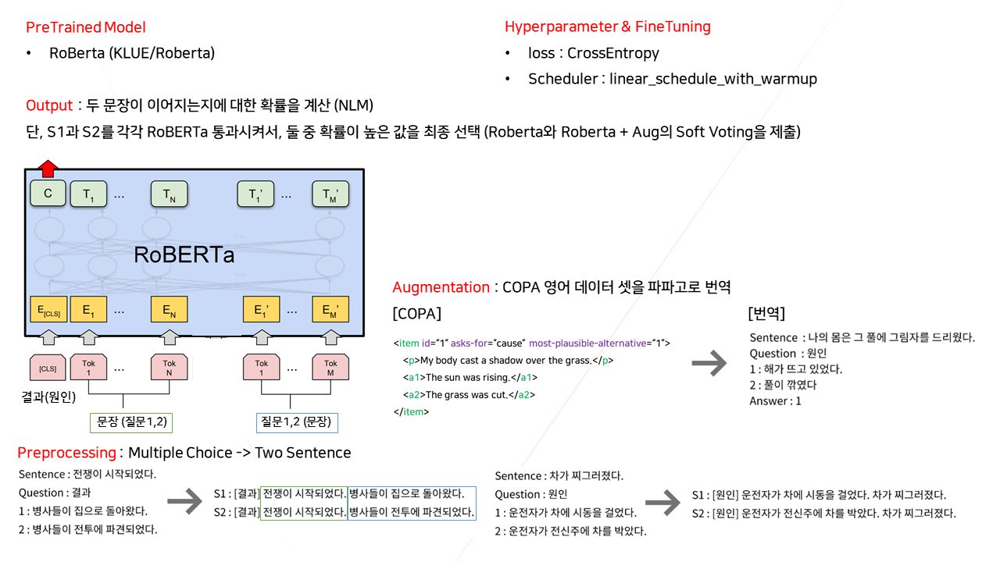

# NIKL-KLUE

본 레퍼지토리는 국립국어원에서 열린 [인공 지능 언어 능력 평가](https://corpus.korean.go.kr/task/taskLeaderBoard.do?taskId=4&clCd=ING_TASK&subMenuId=sub04)에서 문화체육관광부 장관상을 받은 자료입니다. 

## 팀원

| [김강민](https://github.com/Gangsss)                         | [김현우](https://github.com/choco9966)                       | [이동빈](https://github.com/Dongbin-Lee-git)                 | [신문종](https://github.com/moon-jong)                       | [서석민](https://github.com/min1321)                         | [임도훈](https://github.com/vail131)                         |
| ------------------------------------------------------------ | ------------------------------------------------------------ | ------------------------------------------------------------ | ------------------------------------------------------------ | ------------------------------------------------------------ | ------------------------------------------------------------ |
|  |  |  |  |  |  |

## 솔루션

### COPA

## 가중치 파일

- boolq : https://drive.google.com/file/d/1k-6W3bTqFVlSBBtsJ42kPcBdBCO7bQkD/view?usp=sharing  
- copa : https://drive.google.com/file/d/1PxwwOiYxKb7PUBVByX0LYwnXm9IY6lfh/view?usp=sharing  
- cola : https://drive.google.com/file/d/1SqFO4E2M1qIIJHusubUb5r2dklLdvlME/view?usp=sharing  
- wic : https://drive.google.com/drive/folders/1Jj-AgW7w608gwwrBFUujiv104huK3zLl?usp=sharing

## Presentation PDF
https://github.com/NIKL-Team-BC/NIKL-KLUE/blob/main/2021_NIKL_Team_BC.pdf  
